1. Mental model

Unlike Table layout, CSS Grid lets us manage the layout entirely from within CSS.


2. Grid flow

By default, CSS Grid uses a single column, and will create rows as needed, based on the number of children. This is known as an implicit grid, since we aren't explicitly defining any structure.


- Implicit grids

Implicit grids are dynamic; rows will be added and removed based on the number of children. Each child gets its own row.

By default, the height of the grid parent is determined by its children. It grows and shrinks dynamically. Interestingly, this isn't even a “CSS Grid” thing; the grid parent is still using Flow layout, and block elements in Flow layout grow vertically to contain their content. Only the children are arranged using Grid layout.

But what if we give the grid a fixed height? In that case, the total surface area is divided into equally-sized rows:


3. Grid Construction

By passing two values to grid-template-columns — 25% and 75% — I'm telling the CSS Grid algorithm to slice the element up into two columns.

Columns can be defined using any valid CSS `<length-percentage>` value(opens in new tab), including pixels, rems, viewport units, and so on. Additionally, we also gain access to a new unit, the fr unit:

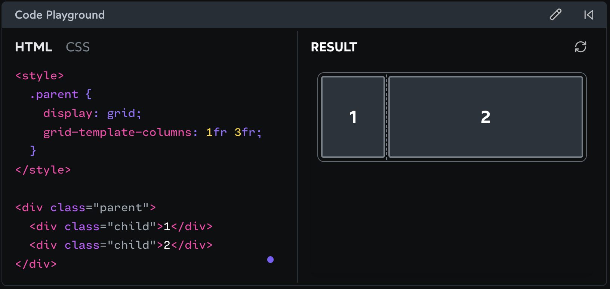

- fraction & Percentages

Percentage-based columns are rigid, and so our ghost image will overflow, spilling out of the column.

fr-based columns are flexible, and so the column won't shrink below its minimum content size, even if that means breaking the proportions.


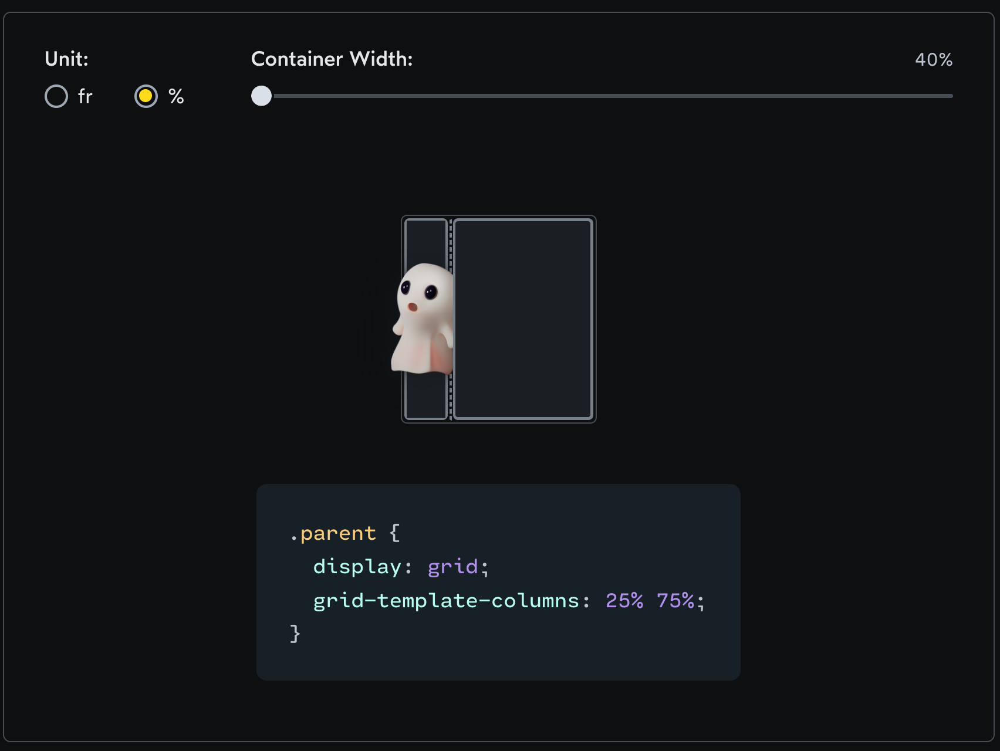

To be more precise: the fr unit distributes extra space. First, column widths will be calculated based on their contents. If there's any leftover space, it'll be distributed based on the fr values. 

We can see a perfect example of this with gap. gap is a magical CSS property that adds a fixed amount of space between all of the columns and rows within our grid.


Notice how the contents spill outside the grid parent when using percentage-based columns? This happens because percentages are calculated using the total grid area. The two columns consume 100% of the parent's content area, and they aren't allowed to shrink. When we add 16px of gap, the columns have no choice but to spill beyond the container.

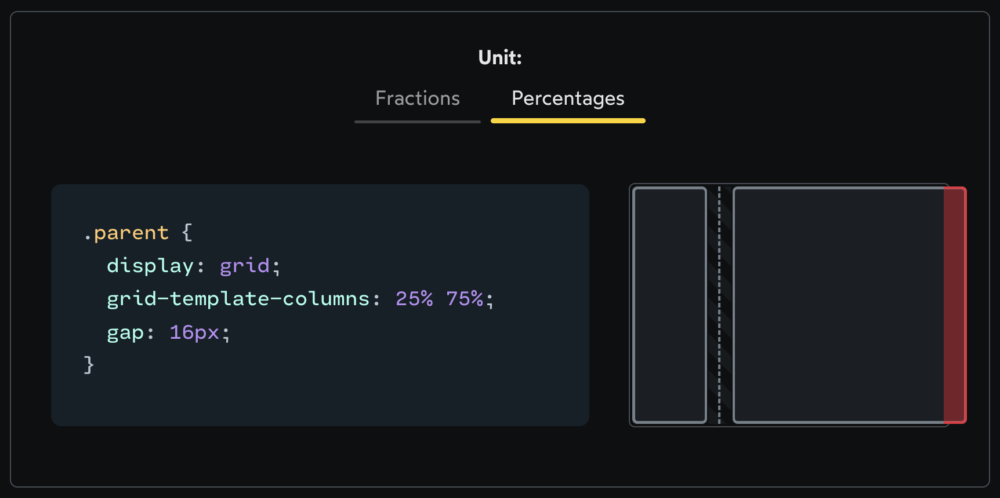

The fr unit, by contrast, is calculated based on the extra space. In this case, the extra space has been reduced by 16px, for the gap. The CSS Grid algorithm distributes the remaining space between the two grid columns.

- Implicit and explicit rows

Implicit - The grid algorithm wants to ensure that every child has its own grid cell.

- explicit - define the column & rows explicitly, to create a specific layout.

- The repeat helper
```css
.calendar {
  display: grid;
  grid-template-columns: repeat(7, 1fr);
}
```

4. Assigning children

The grid-row and grid-column properties allow us to specify which track(s) our grid child should occupy.

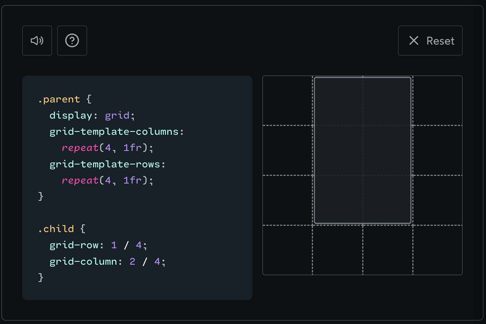

If we want the child to occupy a single row or column, we can specify it by its number. grid-column: 3 will set the child to sit in the third column.

Grid children can also stretch across multiple rows/columns. The syntax for this uses a slash to delineate start and end:

```css
.child {
  grid-column: 1 / 4;
}
```

There's a sneaky gotcha here: The numbers we're providing are based on the column lines, not the column indexes.

It'll be easiest to understand this gotcha with a diagram:


5. Negative line numbers


6. Spanning multiple rows/columns


```css
.grid {
  display: grid;
  grid-template-columns: repeat(4, 1fr);
  grid-template-rows: repeat(3, 1fr);
}
.featured.child {
  grid-column: span 2;
}
```

7. Awkwardly-placed featured children?

What happens if we put a two-column-wide grid child in the last column??

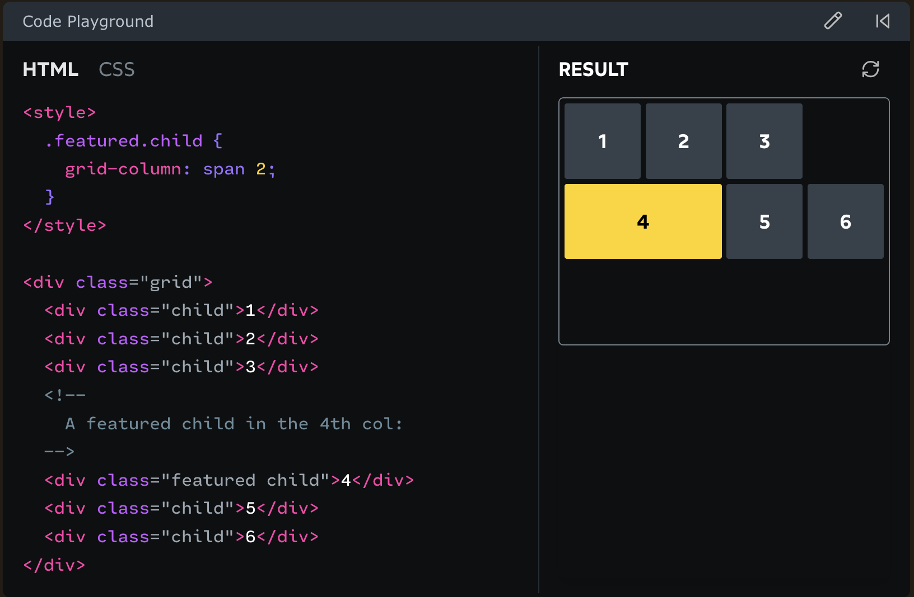

The featured child can’t fit in that final column. As a result, it’s pushed to the next row, and a blank spot is left in the first row’s final cell.

CSS Grid has a neat trick for this sort of situation. If the order of the children isn’t important, we can instruct the browser to cram the children in wherever they’ll fit. Check this out:

In this case, it discovered that the fifth grid child would fit in that fourth grid cell, and so it gets plucked up and moved ahead of the featured child.

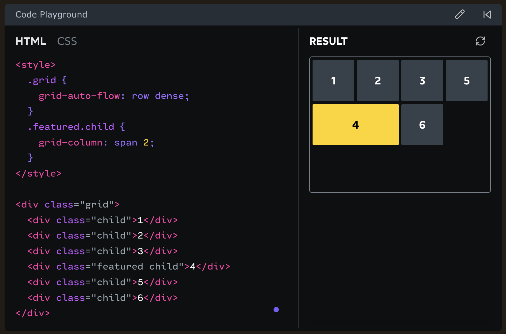

8. Grid areas

Each line represents a row, and each word is a name we're giving to a particular slice of the grid.

Then, instead of assigning a child with grid-column and grid-row, we assign it with grid-area!

When we want a particular area to span multiple rows or columns, we can repeat the name of that area in our template.

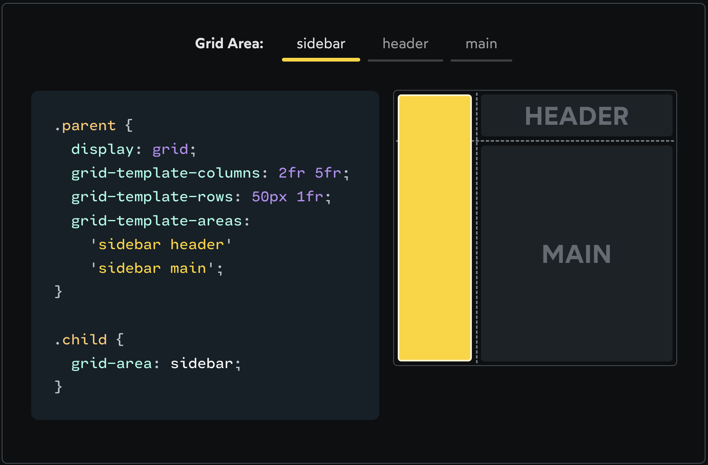

9. Being mindful of keyboard users

There's a big gotcha when it comes to grid assignments: tab order will still be based on DOM position, not grid position.

10. Alignment

In all the examples we've seen so far, our columns and rows stretch to fill the entire grid container.

For example, let's suppose we define two columns that are each 90px wide. As long as the grid parent is larger than 180px, there will be some dead space at the end:

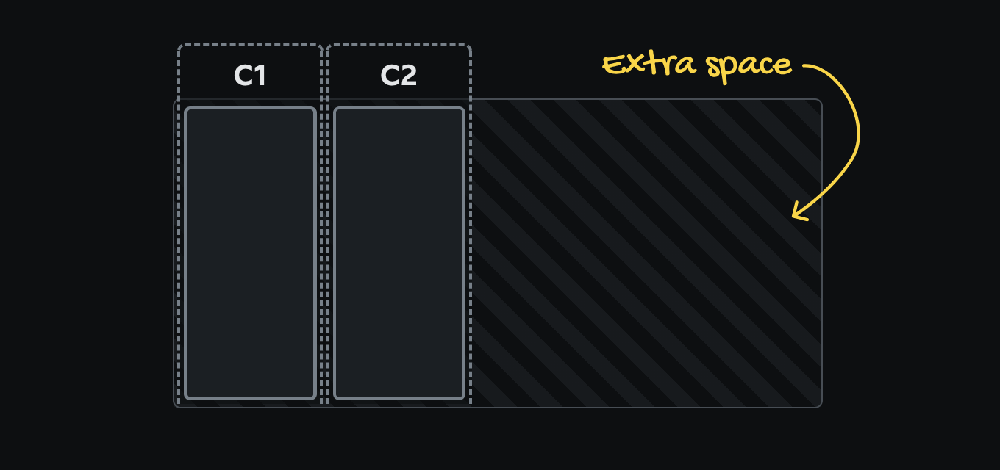

We can control the distribution of the columns using the justify-content property:

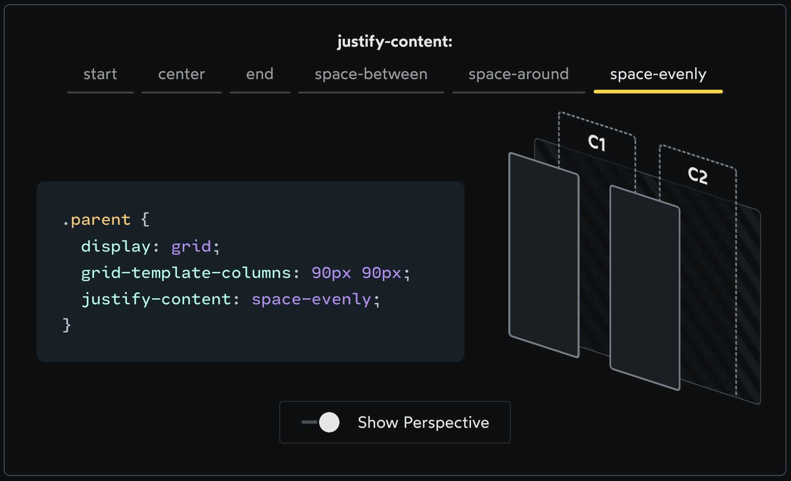

Essentially, justify-content lets us arrange the compartments of our grid, distributing them across the grid however we wish.

If we want to align the items themselves within their columns, we can use the justify-items property:

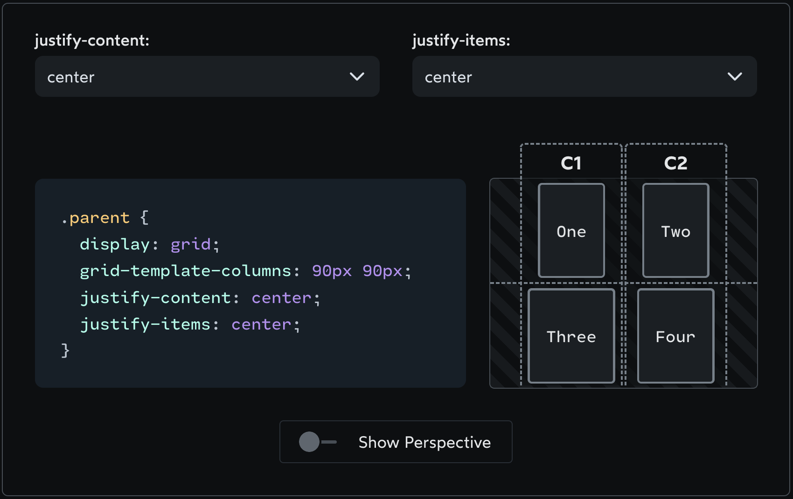

This is useful because it allows us to break free from the rigid symmetry of columns. When we set justify-items to something other than stretch, the children will shrink down to their default width, as determined by their contents. As a result, items in the same column can be different widths.

We can even control the alignment of a specific grid child using the justify-self property:

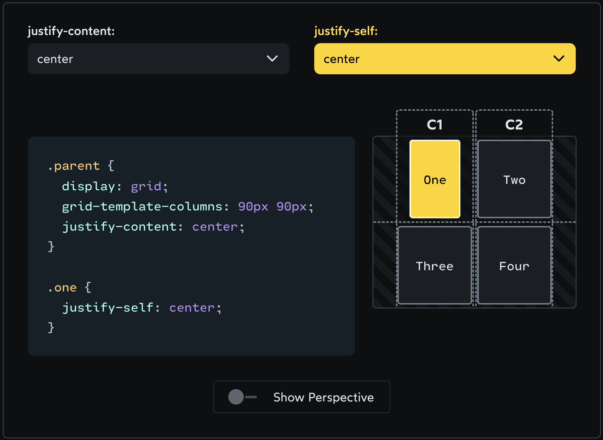

Unlike justify-items, which is set on the grid parent and controls the alignment of all grid children, justify-self is set on the child. We can think of justify-items as a way to set a default value for justify-self on all grid children.

11. Aligning rows

So far, we've been talking about how to align stuff in the horizontal direction. CSS Grid provides an additional set of properties to align stuff in the vertical direction:


To break things down even further:

- justify — deals with columns.
- align — deals with rows.
- content — deals with the grid structure.
- items — deals with the DOM nodes within the grid structure.

Finally, in addition to justify-self, we also have align-self. This property controls the vertical position of a single grid item within its cell.

12. Two-line centering trick

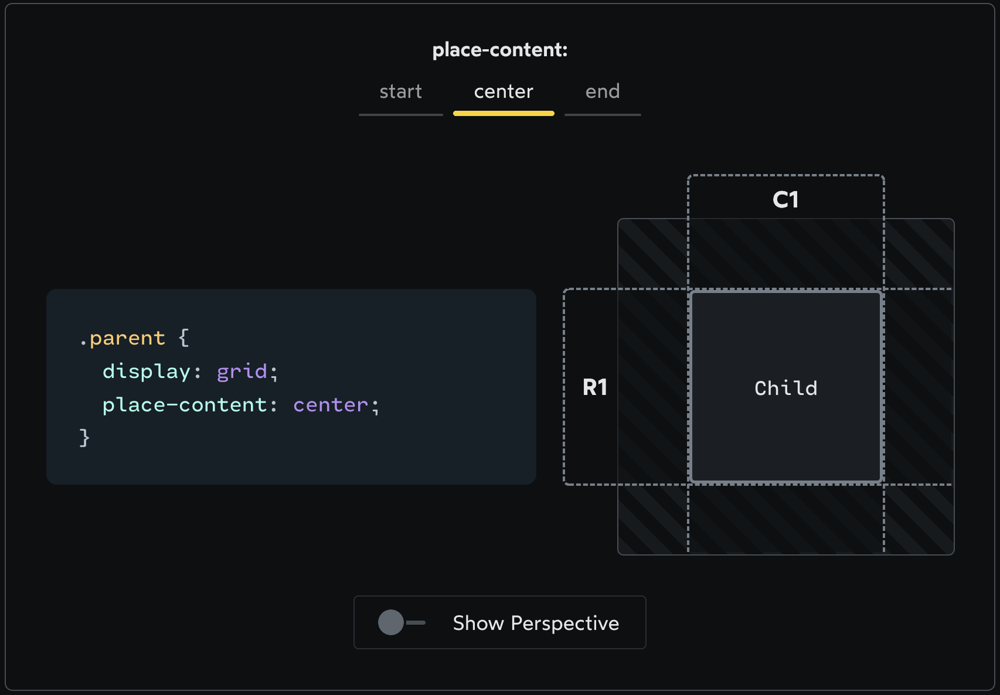;