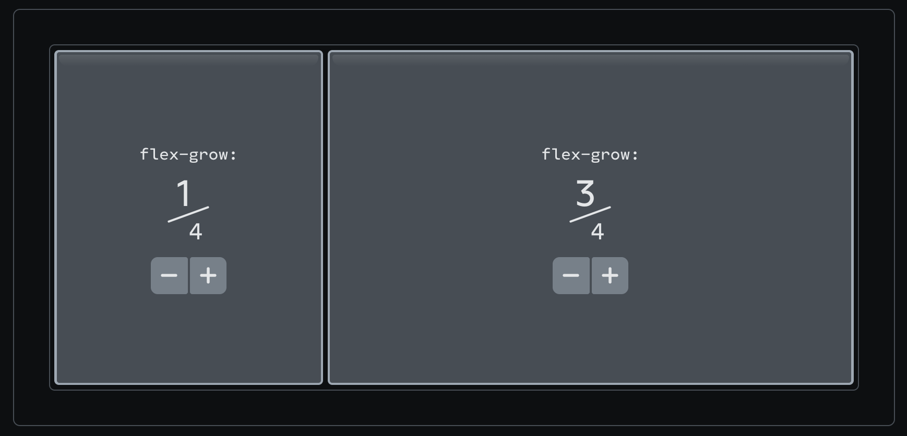
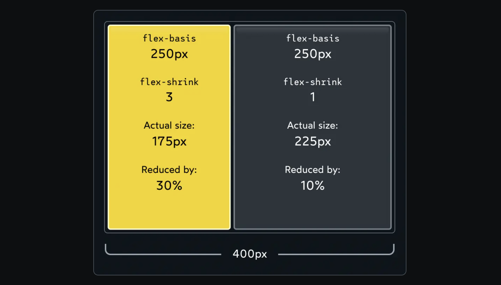
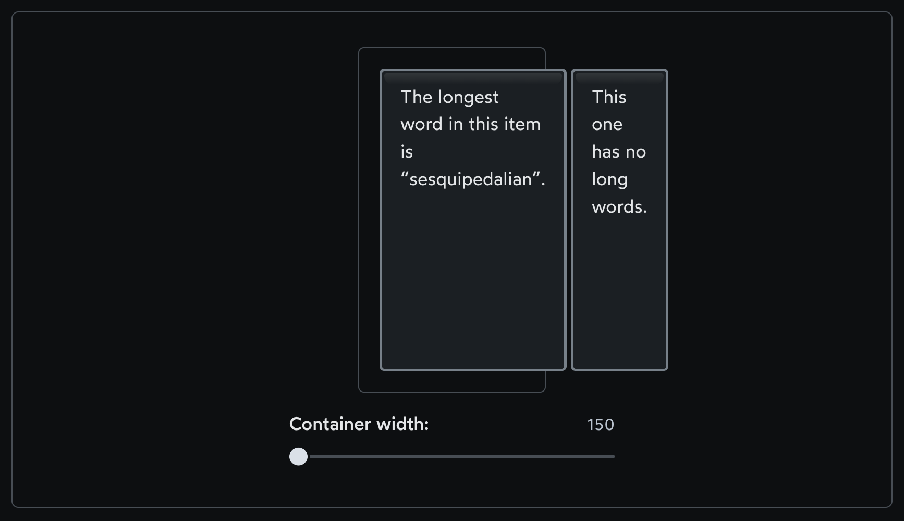
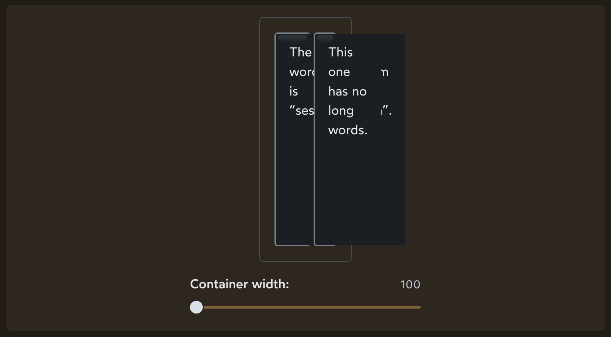
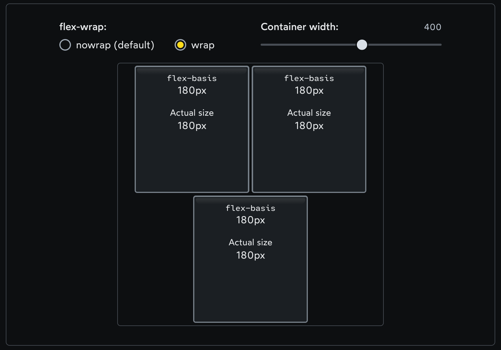
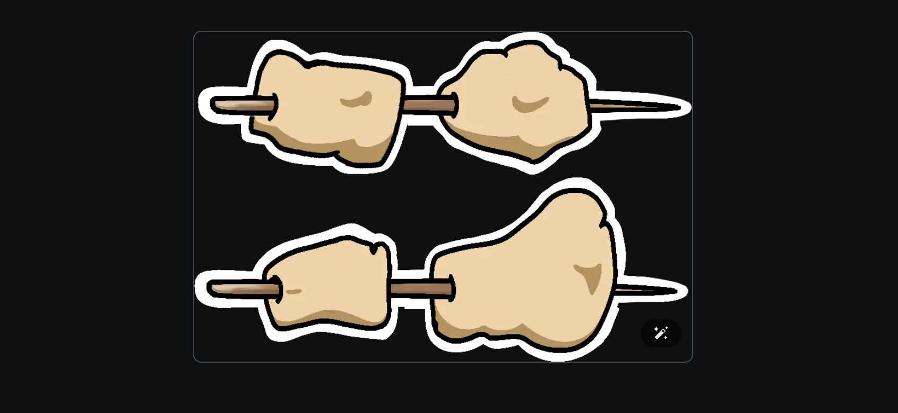
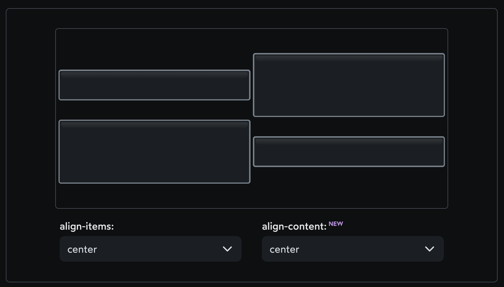

1. When we flip display to flex, we create a “flex formatting context”. This means that, by default, all children will be positioned according to the Flexbox layout algorithm.

2. Flexbox is all about flexibility. We can control whether items grow or shrink, how the extra space is distributed, and more.

3. Flex direction - By default, items will stack side-by-side in a row, but we can flip to a column with the flex-direction property

4. The children will be positioned by default according to the following 2 rules:
- Primary axis: Children will be bunched up at the start of the container.
- Cross axis: Children will stretch out to fill the entire container.
;

5. justify-content & align-items

;

6. align-self is applied to the child element, not the container. It allows us to change the alignment of a specific child along the cross axis:

;

align-self has all the same values as align-items. In fact, they change the exact same thing. align-items is syntactic sugar, a convenient shorthand that automatically sets the alignment on all the children at once.

7. Content vs. items - For that matter, why is there an align-self, but not a justify-self??

When we're talking about alignment in the cross axis, each item can do whatever it wants. In the primary axis, though, we can only think about how to distribute the group.

;
;

each item can move along its stick without interfering with any of the other items:
;

 a single item can’t move along its stick without bumping into its siblings! 
;

- justify — to position something along the primary axis.
- align — to position something along the cross axis.
- content — a group of “stuff” that can be distributed.
- items — single items that can be positioned individually.

8. headingHypothetical size

The difference is the layout mode. The first item is being rendered using Flow layout, and in Flow layout, width is a hard constraint. 

In this case, the limiting factor is that the parent doesn't have room for a 2000px-wide child. And so, the child's size is reduced so that it fits.

;

9. Growing and shrinking

- flex-basis
To put it simply: In a Flex row, flex-basis does the same thing as width. In a Flex column, flex-basis does the same thing as height.

width and height don't follow this rule, though!

It allows us to set the hypothetical size of an element in the primary-axis direction, regardless of whether that's horizontal or vertical.

At a certain point, there just isn't enough space for all of the elements to sit at their assigned size, and so they have to compromise, in order to avoid an overflow.

;

Not exactly the same - For example, the width property affects replaced elements like images differently than flex-basis. Also, width can reduce an item below its minimum size, while flex-basis can't.

- flex-grow

By default, elements in a Flex context will shrink down to their minimum comfortable size along the primary axis. This often creates extra space.

The default value for flex-grow is 0

;

;

What if multiple children set flex-grow?

;

- flex-shrink

In most of the examples we've seen so far, we've had extra space to work with. But what if our children are too big for their container?

;

by default, they'll always scale together, preserving the ratio between both elements.

what if we don't want our elements to scale down proportionally? That's where the flex-shrink property comes in.

We have a total deficit of 100px. Normally, each child would pay ½, but because we've tinkered with flex-shrink, the first element winds up paying ¾ (75px), and the second element pays ¼ (25px).

;

flex-grow controls how the extra space is distributed when the items are smaller than their container.

flex-shrink controls how space is removed when the items are bigger than their container.

This means that only one of these properties can be active at once. If there's extra space, flex-shrink has no effect, since the items don't need to shrink. And if the children are too big for their container, flex-grow has no effect, because there's no extra space to divvy up.

- Preventing shrinking

When the container gets narrow, our two circles get squashed into gross ovals. What if we want them to stay circular?

When we set flex-shrink to 0, we essentially “opt out” of the shrinking process altogether. The Flexbox algorithm will treat flex-basis (or width) as a hard minimum limit.

;

10. The minimum size gotcha

Here's the deal: In addition to the hypothetical size, there's another important size that the Flexbox algorithm cares about: the minimum size.

Text inputs have a default minimum size of 170px-200px (it varies between browsers). That's the limitation we're running into above.

In other cases, the limiting factor might be the element's content. For example, try resizing this container:

For an element containing text, the minimum width is the length of the longest unbreakable string of characters.

Here's the good news: We can redefine the minimum size with the min-width property.

By setting min-width: 0px directly on the Flex child, we tell the Flexbox algorithm to overwrite the “built-in” minimum width. Because we've set it to 0px, the element can shrink as much as necessary.

- Proceed with caution

min-width is a particularly powerful property when it comes to Flexbox. It's gotten me out of a jam more than once, but I'm always careful to make sure I'm not making things worse!

11. Gaps

gap allows us to create space in-between each Flex child.

;

12. Auto margins 

Auto margins will gobble up the extra space, and apply it to the element's margin. It gives us precise control over where to distribute the extra space.

;

13. Wrapping

With flex-wrap: wrap, we no longer have a single primary axis line that can skewer each item. Effectively, each row acts as its own mini flex container. 

How does align-items work, now that we have multiple rows? 

Each row is its own mini Flexbox environment. align-items will move each item up or down within the invisible box that wraps around each row.

But what if we want to align the rows themselves? We can do that with the align-content property:

To summarize what's happening here:

- flex-wrap: wrap gives us two rows of stuff.
- Within each row, align-items lets us slide each individual child up or down
- Zooming out, however, we have these two rows within a single Flex context! The cross axis will now intersect two rows, not one. And so, we can't move the rows individually, we need to distribute them as a group.
- Using our definitions from above, we're dealing with content, not items. But we're also still talking about the cross axis! And so the property we want is align-content.